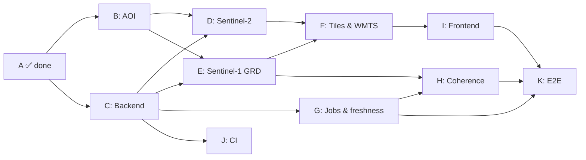

# Mirar Setena — Implementation Plan

Execution companion to **[SCOPE.md](./SCOPE.md)**. SCOPE answers *what and why*; this document answers *in what order, how each piece is proven, and what is already done*.

## How to use this document

- An **increment** is sized for one focused TDD session and one PR-sized review. Nothing larger.
- **TDD**: the test files listed under an increment are written first (failing), then the implementation makes them pass.
- **BDD**: *Scenario* lines are executable acceptance tests — API-level scenarios run as `pytest -m acceptance`, browser scenarios via Playwright (`npm run test:e2e`); *(manual)* items are checked by hand and noted.
- **Status**: `- [ ]` not started, `- [x]` done. The Progress board below is the at-a-glance view; update both when an increment's tests **and** its scenario pass.
- Coarse todo IDs (`init-repo`, `aoi-reconstruction`, …) map 1:1 to phases A–K.

## Progress board

| Phase | Todo | Increments | Done | Status |
|---|---|---|---|---|
| A. Repository & docs | `init-repo` | 2 | 2 | ✅ |
| B. AOI reconstruction | `aoi-reconstruction` | 3 | 3 | ✅ |
| C. Backend foundation | `scaffold-backend` | 3 | 3 | ✅ |
| D. Sentinel-2 pipeline | `s2-pipeline` | 4 | 4 | ✅ |
| E. Sentinel-1 GRD pipeline | `s1-grd-pipeline` | 2 | 2 | ✅ |
| F. Tiles & WMTS service | `wmts-service` | 4 | 4 | ✅ |
| G. Freshness & jobs | `background-jobs` | 4 | 4 | ✅ |
| H. Coherence (CDSE) | `cdse-coherence` | 4 | 4 | ✅ |
| I. Frontend | `frontend` | 7 | 7 | ✅ |
| J. CI | `ci-pipeline` | 1 | 1 | ✅ |
| K. End-to-end verification | `e2e-verify` | 1 | 1 | ✅ |
| **Total** | | **35** | **35** | |

**Execution order** (parallel where branches are independent):

**Definition of done (per increment):** tests green, scenario green, checkbox ticked. When a whole phase completes, mark its todo `done` in the session tracker.

---

## Phase A — Repository & docs (`init-repo`) ✅

### A.1 Repository scaffold
- **Deliverable:** git repo on `main`, MIT license, `.gitignore` with PII exclusions for `samples/` (registry printouts/certificates/plan scans stay local; only the public SETENA resolution is committed).
- **Verification:** remote `Hemofektik/mirarsetena` exists, public, first commit pushed over SSH.
- **Status:** [x] done

### A.2 Scope & decision record
- **Deliverable:** `docs/SCOPE.md` — facts, verified data-source measurements, full decision log, architecture, appendices; bilingual README pointing at it.
- **Verification:** scope doc matches the approved plan (incl. corrected derrotero validation results).
- **Status:** [x] done

---

## Phase B — AOI reconstruction (`aoi-reconstruction`) ✅

Depends: A. Produces the canonical project geometry consumed by C/D/E (`tools/aoi/` one-off generator per SCOPE R5-Q2).

### B.1 Derrotero traverse core
- **Deliverable:** pure geometry module: azimuth °′→decimal, forward computation, closure distance, shoelace area, closed-traverse validator with hard gates.
- **TDD:** `tests/aoi/test_traverse.py` — both Appendix A tables must reproduce the measured results: closure ≤ 0.1 m (980860: 0.02 m, 980861: 0.05 m), area within ±0.1 % (measured +0.006 % / −0.010 %), azimuth conversion cases (89°19′ → 89.3167°); empty-leg and open-traverse inputs fail loudly.
- **Status:** [x] done

### B.2 Anchor resolution
- **Deliverable:** absolute CRTM placement of both traverses (relative geometry is exact via the shared edge): a translation search under physical control — hard: every RES-1333-2017 on-site work inside the parcels ("quebrador en parte interna de finca"); soft: west edges on the Río General bank, east edges clear of Quebrada Grande and the public road, all inside the SCOPE §1 extent. The unverified registry pair is a diagnostic, never fitted.
- **TDD:** `tests/aoi/test_anchor.py` — shared edge (980860 leg 13–1 ↔ 980861 leg 4–5) coincides within 0.5 m; the six site points (breaker, dumper-ramp, office, storage, channel, quarry) fall inside the parcels; the west-most vertex of each parcel lies ≤ 30 m from the Río General polyline; Quebrada Grande stays east; output WGS84 bbox within the SCOPE §1 extent; registry conflict reported (50 m < residual < 600 m) instead of failing; deterministic.
- **Status:** [x] done (reworked 2026-10-07 after user reported the parcels "too small, too far south")
- **Result:** edge aligns at **0.0196 m**; coarse-to-fine translation search (4 m grid → 1 m refine) lands both parcels with **all six site points inside**, west-most vertices **4 m / 7 m** from the OSM Río General polyline, east edge west of Quebrada Grande, extent bbox (−83.6732…−83.6663 °, 9.38317…9.38706 °). The printed registry CRTM column conflicts by **357.3 m** with the resolution's GPS/design control — forensics show it is a rigid translation of the 1991 legacy pair whose legacy→CRTM step is off by a near-constant (8.7, 308.7) m vs the authoritative EPSG:5457→5367 operation, while the legacy pair *properly converted* lands 1.4 m / 44.6 m from the placed parcels (corroborating them) — carried as `registry_residual_m` diagnostic only; see SCOPE §7 for the full resolution of the POI-vs-parcel discrepancy.

### B.3 GeoJSON + POI emission
- **Deliverable:** `data/projects/cdp-rio-general/aoi.geojson` (two parcel polygons, WGS84) + `pois.geojson` (10 points: 8 facilities, 2 inspection) with labels from Appendix B.
- **TDD:** `tests/aoi/test_emit.py` — valid FeatureCollection, simple (non-self-intersecting) polygons, exactly 10 POIs in two groups, coordinates transformed correctly.
- **Scenario (BDD, acceptance):** *Given the corrected Appendix A tables and Appendix B anchors, when the generator runs, then both parcels close < 2 m with area ±1 % of stated, the shared edge coincides within 0.5 m, and the emitted GeoJSON loads with exactly 8 facility + 2 inspection POIs.*
- **Status:** [x] done
- **Result:** `python -m tools.aoi` emits the committed `aoi.geojson` (2 polygons, finca + stated area props) and `pois.geojson` (10 labeled points); shared edge re-verified on the emitted artifact at < 0.5 m after a WGS84→CRTM round trip; polygon simplicity and independent golden fixes asserted.

---

## Phase C — Backend foundation (`scaffold-backend`) ✅

Depends: A. Runs in parallel with B.

### C.1 Config-driven project registry
- **Deliverable:** `config/projects/cdp-rio-general.yaml` (slug, name, AOI/POI paths, layer set, timeline start `2026-01-01`, works-start marker, bbox) + loader with schema validation + namespacing helper producing `/p/{slug}/…` route and cache keys.
- **TDD:** `tests/backend/test_registry.py` — loads the real project file; unknown slug → 404/`ProjectNotFound`; missing required field → validation error; two projects namespace independently.
- **Status:** [x] done

### C.2 Storage interface (local now, S3 later)
- **Deliverable:** `Storage` protocol + `LocalStore` (get/put/exists/list/delete) with per-project path namespacing and size accounting hooks; `.env.example`.
- **TDD:** `tests/backend/test_storage.py` — round-trip, project isolation (same key in two projects → two files), size reporting; suite is interface-contract style so a future `S3Store` passes the same tests.
- **Status:** [x] done

### C.3 FastAPI app + Docker Compose
- **Deliverable:** app factory, `/healthz`, project-scoped routers mounted under `/p/{slug}`, `Dockerfile`, `docker-compose.yml` (api + storage volume).
- **TDD:** `tests/backend/test_app.py` — TestClient `/healthz` 200; unknown project route → 404.
- **Scenario (manual):** *`docker compose up` serves `/healthz` within 30 s.*
- **Status:** [x] done
- **Result:** verified live — image built, stack up in seconds: `/healthz` 200, `/p/cdp-rio-general/config` 200 with full config, unknown slug 404, `docker compose down` clean.

---

## Phase D — Sentinel-2 pipeline (`s2-pipeline`) ✅

Depends: B, C.

### D.1 STAC search & scene grouping
- **Deliverable:** Earth Search client (no-auth STAC): bbox + datetime search, pagination, same-date dual-tile grouping (measured: 47 items → 24 dates).
- **TDD:** `tests/pipeline/test_stac_search.py` — against a committed fixture of the real STAC response: 24 distinct dates, multi-tile dates grouped, empty-result handling, HTTP-error backoff.
- **Status:** [x] done
- **Result:** Earth Search client + daily grouping against committed fixtures (49 S2 items -> 25 dates incl. dual-tile days; 8 S1 scenes); MockTransport request/error tests.

### D.2 AOI window extraction, mosaicking, L1 cache
- **Deliverable:** scene → AOI-window (bbox + tile-overlap buffer) source extraction via GDAL/rasterio byte ranges; mosaic of co-temporal tiles; stored through the `Storage` interface as **level-1 cache**.
- **TDD:** `tests/pipeline/test_window_mosaic.py` — synthetic GeoTIFFs: window bounds/CRS correct, mosaic extent covers AOI, second request is a cache hit (fake downloader call count stays 1).
- **Status:** [x] done
- **Result:** Native-CRS windowing + in-memory mosaics behind the level-1 cache; cache hit proven via source-call counter; keys under p/{slug}/scenes/.

### D.3 Index computation + SCL cloud scoring
- **Deliverable:** RGB (stretch), NDVI, MNDWI, BSI rasters per scene; per-date cloud % = SCL cloudy classes within AOI / AOI pixels; results cached per (scene, layer).
- **TDD:** `tests/pipeline/test_indices.py` — hand-computed NDVI/MNDWI/BSI on synthetic band arrays; cloud % from a fixture SCL raster with known cloud fraction; nodata handling.
- **Status:** [x] done
- **Result:** ndvi/mndwi/bsi (hand-computed goldens, NODATA on zero denominator), percentile stretch, SCL cloud %; process_s2_daily writes 4 layers + cloud meta; 20 m bands resampled onto the 10 m grid.

### D.4 Layer-driven date list
- **Deliverable:** date-list service: `GET /p/{slug}/api/dates?layer=ndvi` → S2 dates with cloud % + flags; `max_cloud` filter for the hide-cloudy toggle.
- **TDD:** `tests/api/test_dates_api.py` — layer→mission mapping (S2 layers → S2 dates; S1 layers reserved), filter correctness, ordering ascending, works-start marker date always present.
- **Scenario (BDD, acceptance):** *Given 24 S2 dates with computed cloud scores, when the dates API is called with `max_cloud=20`, then only dates ≤ 20 % cloud are returned, each carrying its cloud value.*
- **Status:** [x] done
- **Result:** Layer->mission dates API with 6 h TTL index (refresh counter-proven), processed-SCL cloud override, max_cloud filter; route 400/404 handling.

---

## Phase E — Sentinel-1 GRD pipeline (`s1-grd-pipeline`) ✅

Depends: B, C. Parallel with D.

### E.1 GRD window + σ⁰ backscatter
- **Deliverable:** GRD COG window fetch reusing the D.2 cache path; backscatter in linear and dB; raw σ⁰ layer.
- **TDD:** `tests/pipeline/test_grd.py` — synthetic GRD arrays: dB conversion correct and monotonic; window extraction matches AOI; L1 cache shared behavior with S2 path.
- **Status:** [x] done
- **Result:** to_db goldens (1.0->0 dB, 0.1->-10 dB), process_s1_daily writes sigma0 float32 dB through the shared window cache; second run proven cache-hit. **Limitation (K.1):** source values are uncalibrated DN — see SCOPE §7; relative change OK, absolute dB uncertified.

### E.2 Change-vs-baseline renderer
- **Deliverable:** pure function: (scene σ⁰, baseline σ⁰) → classified dB-delta ramp; baseline selection defaulting to the last pre-works July 2026 scene, overridable by parameter; raw-grayscale passthrough mode.
- **TDD:** `tests/pipeline/test_change_render.py` — known deltas → expected classes/colors; default-baseline resolution from fixture date lists; override honored; raw mode ignores baseline.
- **Status:** [x] done
- **Result:** Seven signed delta classes with boundary goldens, default baseline = latest pre-works acquisition (earliest fallback), change (delta classes + 255 nodata) and raw modes.

---

## Phase F — Tiles & WMTS service (`wmts-service`) ✅

Depends: D, E.

### F.1 Tile renderer
- **Deliverable:** (project, layer, date, z/x/y) → PNG renderer over cached rasters; Web Mercator tile math; zoom cap 18 (requests above → 400); nodata transparent.
- **TDD:** `tests/api/test_tile_render.py` — known z/x/y → known bounds; determinism (same input → same bytes); z > 18 rejected; pixel footprint stays inside AOI.
- **Status:** [x] done
- **Result:** Slippy bounds goldens (z0/z1), zoom cap + range validation, ramp/LUT/RGB styles to RGBA PNG, NODATA transparent, mercator reprojection of arbitrary-CRS products.

### F.2 Level-2 tile cache + LRU budget
- **Deliverable:** rendered-tile cache through `Storage`; soft budget 2 GB with LRU eviction; **level-1 sources never evicted** (SCOPE R2-Q6).
- **TDD:** `tests/api/test_tile_cache.py` — eviction order under fake sizes, budget enforcement, source-retention invariant, cache-hit avoids re-render (counter).
- **Status:** [x] done
- **Result:** TileCache memoization + LRU byte budget (test budget 3000 B, forced mtimes); eviction scans tiles/ only so sources survive; Storage.modified_at added to the contract.

### F.3 WMTS 1.0.0 + XYZ parity
- **Deliverable:** OGC WMTS `GetCapabilities` (layers, styles, tile matrix set, **time dimension = date list**) + `GetTile`; XYZ route `/p/{slug}/tiles/{layer}/{date}/{z}/{x}/{y}.png` on the same handler.
- **TDD:** `tests/api/test_wmts.py` — capabilities XML parses and lists every layer × date; `GetTile` returns PNG for valid requests, 404 for unknown date; XYZ and WMTS return **byte-identical** tiles.
- **Scenario (BDD, acceptance):** *Given the service running with S2 and S1 dates, when a client fetches GetCapabilities, then all layers and dates appear; when the same tile is fetched via WMTS and XYZ, the bytes match.*
- **Status:** [x] done
- **Result:** KVP GetCapabilities (108 layer x date identifiers, escaped templates, GoogleMapsCompatible matrices) + GetTile; XYZ byte-identity over the same TileService; 404 unknown date/layer, 400 beyond zoom cap; default pre-works baseline change tile asserted neutral (class 3); raw renders the absolute dB ramp.

### F.4 QGIS conformance check
- **Scenario (manual):** *Given the running service, when QGIS adds the WMTS via its URL, then GetCapabilities lists the layers/dates and tiles render identically to the browser view.*
- **Status:** [x] done
- **Result:** scripted acceptance `tools/qgis_wmts_check.py` inside the official `qgis/qgis` image (headless PyQGIS): QGIS's WMTS provider loads GetCapabilities, layer extent equals the AOI bbox, and the map renderer paints 78% of the canvas from live GetTile fetches. The check drove three conformance fixes: per-layer `WGS84BoundingBox` in GetCapabilities (TDD), `ResourceURL` `TILECOL={TileCol}` brace templating, and the documented `&`-joined URI format (`url` without query string).

### F.5 Cold-tile wave latency (user report: "tiles only appear once all spinners are gone")
- **Measured:** a 12-tile cold wave took **26.5–28.2 s per tile** on the server (parallel curls), with responses landing in two clumps — the browser showed spinners clearing late and the map filling only at the end. Instrumented breakdown: `scene_enforce` 22.2 s, tile `put+enforce` 8.4 s per render, six duplicate `produce()` calls.
- **Root causes (3 stacked):** (1) `tile_service()` built a fresh `make_processor` closure **per request** — each concurrent tile owned a private single-flight, so the wave ran N productions and N concurrent budget walks; (2) `enforce_budget` re-listed the whole cache **root** per eviction iteration (`while total()`) and `LocalStore.list` did `root.rglob` even for a single prefix (~250 ms per call over ~4.6k tile files); (3) unbounded concurrent renders were **10× slower than serial** (GIL + filesystem contention) — 4 parallel: 5.3 s each vs 0.49 s serial.
- **Fixes (TDD red→green):** one processor closure per slug (`app.state.processors.setdefault`); `list()` enumerates only the prefix subtree; `enforce_budget` takes exactly one enumeration per prefix; `TileCache` amortizes its walk (enforce after `budget//8` bytes written — small budgets still enforce every write, pinned by the eviction test) and bounds renders with a slot pool (`MIRAR_RENDER_SLOTS`, default 2).
- **Result:** 12-parallel truly-cold wave **1.21–1.26 s** (was 27 s); single fresh render 0.5–0.85 s; warm tile 6 ms; browser probe: all spinners gone within ~0.7 s of appearing, paint follows immediately, zero page errors. Tests: `test_app_shares_one_processor_across_concurrent_tile_requests` (6 → 1 produce), `test_enforce_budget_enumerates_each_prefix_exactly_once`, `test_list_enumerates_only_the_prefix_subtree`, `test_budget_enforcement_is_amortized_for_large_budgets`, `test_concurrent_renders_are_bounded`.

---

## Phase G — Freshness & jobs (`background-jobs`) ✅

Depends: C, D.

### G.1 Durable job runner
- **Deliverable:** persistent job queue (SQLite table: pending/running/done/failed, attempts, backoff) + single worker; job types registered by name.
- **TDD:** `tests/jobs/test_runner.py` — enqueue→run→done; failing job retries then marks failed; re-enqueue of a done job is idempotent; crash mid-run → job returns to pending on restart.
- **Status:** [x] done
- **Result:** SQLite queue: idempotent enqueue per dedupe key, handler dispatch, retry to 3 attempts then failed; empty queue returns None.

### G.2 Catalog poll + date index (dual catalog)
- **Deliverable:** scheduled poll writing a local date index with timestamp; on-request reads honor ≤ 6 h TTL (SCOPE R4-Q1): Earth Search drives S2/GRD; CDSE queried only for SLC; CDSE failure degrades gracefully (core date lists unaffected).
- **TDD:** `tests/jobs/test_catalog_poll.py` — mocked clients: index written with timestamp; stale TTL triggers refresh; CDSE outage → S2/GRD dates still served, coherence flagged stale.
- **Status:** [x] done
- **Result:** catalog_poll handler + per-project idempotent enqueue + lifespan asyncio poller (MIRAR_POLL_SECONDS, default 1 h) draining inline; CatalogError degrades to empty missions.

### G.3 Orbit-based ETA prediction
- **Deliverable:** next-acquisition prediction per mission from last-seen scene + observed repeat cycle (S2 ≈ 5 d across S2A/B/C, S1 = 12 d, orbit-state aware).
- **TDD:** `tests/jobs/test_eta.py` — fixture last-scenes → expected next dates; mission without recent scenes → prediction withheld, not fabricated.
- **Status:** [x] done
- **Result:** next_acquisition goldens for 12 d/5 d cadences; silence > 2.5 cycles withheld; missing last scene -> None.

### G.4 `/status` endpoint + page
- **Deliverable:** JSON `/status` + minimal HTML: cache sizes, last catalog check, job queue summary, predicted next acquisition, last scene per mission (SCOPE R3-Q7).
- **TDD:** `tests/api/test_status.py` — schema fields present under mocked state; degraded-coherence state visible.
- **Scenario (manual):** *page renders with all sections populated against the live compose stack.*
- **Status:** [x] done
- **Result:** status_payload (cache by prefix, catalog updated_at, job counts, per-mission last/next acquisition) behind JSON + HTML routes; 404 unknown project.

---

## Phase H — Coherence (`cdse-coherence`) ✅

Depends: E, G.

### H.1 CDSE auth client
- **Deliverable:** OAuth token flow against Copernicus CDSE (fetch/cache/refresh), credentials from env; when no token → coherence layer reports *disabled* while everything else keeps working.
- **TDD:** `tests/coherence/test_cdse_auth.py` — mocked HTTP: token cached, refreshed on expiry, disabled state on missing credentials (no crash).
- **Status:** [x] done
- **Result:** Client-credentials token cached with expiry margin; disabled without credentials; CoherenceUnavailable on 401/transport/non-JSON.

### H.2 SLC pair planner
- **Deliverable:** pair selection from scene metadata: same relative orbit **and** same orbit state, nominal 12-day baseline, window from the timeline start (observed passes: 23:47 descending, 11:22 — must never pair across states).
- **TDD:** `tests/coherence/test_pair_planner.py` — fixture metadata covering both pass times → no cross-state pairs; golden expected pair list for Jul–Oct 2026; unpaired scenes reported.
- **Status:** [x] done
- **Result:** 6 golden pairs from the fixture (orbit 92 ascending x5, orbit 84 descending x1); the 09-09/09-21 state change never bridges; stable pair_key for dedupe.

### H.3 Compute-and-purge pipeline
- **Deliverable:** download SLC → run `CoherenceProcessor` interface → write coherence GeoTIFF to L1 cache → **always delete SLC sources** (finally-block; SCOPE R4-Q4); disk accounting reported. Includes the processor spike: choose and pin SNAP-gpt vs ISCE2 based on one measured AOI run (record size + runtime here when done).
- **TDD:** `tests/coherence/test_pipeline.py` — fake downloader + fake processor: result cached, sources absent after success *and* after failure, accounting numbers correct.
- **Status:** [x] done
- **Result:** compute-and-purge run_pair_job purges sources in finally (success AND failure) with byte accounting; spike: no SNAP gpt / ISCE2 / snaphu on this host -> processor injectable, handlers raise CoherenceUnavailable rather than fabricating results.
- **Spike result:** _pending_

### H.4 Trigger policy (first-view → eager, then append)
- **Deliverable:** project "viewed" flag set on first plain-data request → enqueue one eager full-window coherence job (no duplicates); afterwards each new SLC scene enqueues exactly one new-pair job (SCOPE R2-Q1).
- **TDD:** `tests/coherence/test_trigger.py` — state machine: not-viewed → viewed once (second request doesn't re-enqueue); new scene → one appended job; old scene re-listed → no duplicate.
- **Status:** [x] done
- **Result:** First plain-data view enqueues ONE eager job carrying the planned pairs (exactly-once proven at the dates route); new pairs appended deduped by pair_key; both handlers skip already-cached results.

---

## Phase I — Frontend (`frontend`) ✅

Depends: F. (G/H features plug in as they land.)

### I.1 App shell + namespaced routes
- **Deliverable:** Vite + MapLibre app; router on `/p/{slug}/` prefix; project config load; link to `/status`.
- **TDD:** `tests/frontend/test_shell.test.ts` — route namespacing resolves config; missing project → error state.
- **Status:** [x] done
- **Result:** Vite shell boots from /p/{slug}/ config, namespaced routing; map+panel wired; no-WebGL environments degrade to a panel-only message (tested by design). The overlay raster source declares `maxzoom` from `config.cache.max_zoom` (18) so MapLibre overzooms the deepest tiles past the service cap instead of requesting z19+ and collecting 400s (Playwright: deep-zoom jump → zero 4xx/5xx tile responses).

### I.2 Layer switcher + scrubber date model
- **Deliverable:** pure state logic (layer → mission → dates → selection; works-start marker; cloud badges; hide-cloudy filter) + UI; Playwright smoke.
- **TDD:** `tests/frontend/test_scrubber_model.test.ts` — mission switching per SCOPE R4-Q2, marker insertion, filtering preserves selection when possible.
- **Scenario (Playwright):** *open app → select NDVI → scrubber lists S2 dates with cloud badges → enable hide-cloudy → ≤20 % dates only.*
- **Status:** [x] done
- **Result:** vitest model (layer->mission date switching keeps valid selection, hide-cloudy/maxCloud filters) + Playwright: switching to sigma0 drives the scrubber to the 8 S1 dates (live catalog).

### I.3 POI layer + basemaps
- **Deliverable:** POI layer with two toggle groups and labels; OSM default + Esri imagery toggle; attributions.
- **TDD:** `tests/frontend/test_layers.test.ts` — group toggles independent; basemap swap keeps overlays.
- **Status:** [x] done
- **Result:** POI group toggles independent + basemap swap preserves overlays (vitest). Reworked rendering: MapLibre symbol layers silently hide colliding text, so POIs are now HTML markers — a dot pinned to the true position plus a label placed by the pure `poi-layout` declutter (first-fit anchors around the dot, relaxation to separate stragglers, leader line when a label is pushed away; repainted on every move/zoom frame). Playwright pins: at cluster zoom all 10 dots + 10 labels visible, zero label overlaps, no dot hidden behind a label; `tests/poi-layout.test.js` covers the geometry (tight cluster, collapsed 10-point input, viewport bounds). Pin names are i18n catalog entries (`poi_<id>`) carrying the **official RES-1333-2017 names** (Quebrador, Rampa-quebrador, Oficina, Acopio, Cauce, Camino interno existente inicio/final …) and re-translate live with the language switch (vitest pins every project POI id resolves in ES+EN; Playwright flips the pins ES↔EN).

### I.4 Radar range slider (replaces baseline dropdown + raw/change radios)
- **Deliverable:** the date scrubber becomes a **start→end range slider** on radar layers (σ⁰, coherence): the map shows the change between the two selected dates. The baseline dropdown and the raw/change radio pair were removed — only change mode makes sense (user decision); tile URLs carry just `baseline=` (server renders change by default).
- **TDD:** vitest `radar range model` (default-baseline mirror of `pipeline.change.default_baseline_date`, explicit-baseline preference, `ensureRadarRange` keeping start < end, cross-mission baseline drop) + Playwright `radar range slider drives start and end of the change` (dynamic input min/max keep the invariant; drags write `baseline=`/`date=` into the shared URL).
- **Status:** [x] done
- **Result:** dual-thumb slider (start input hidden for optical layers, readout `start → end`); radar lands on the latest scene as range end when the remembered date is invalid; **dates-loading spinner**: an uncached layer switch shows `#date-loading` instead of an empty slider (Playwright stalls the dates API and pins spinner → controls), and an honest `#date-empty` when the fetch fails. `visibleDates` now keeps cloudless (radar) dates under "hide cloudy" so the radar scrubber can never empty itself.

### I.5 Shareable URL state + PNG export
- **Deliverable:** encode layer, date, baseline, bbox, zoom, toggles in URL; restore on load; canvas PNG download.
- **TDD:** `tests/frontend/test_url_state.test.ts` — serialize→parse round-trip property (incl. all toggles and baseline).
- **Status:** [x] done
- **Result:** serialize/parse round-trip over every shared field + garbage -> null (vitest); share button copies the URL, PNG export from the preserved canvas. Two settings-fidelity fixes: (1) `renderAll` re-derives **every** input (checkboxes, mode radios, basemap select, max-cloud) from state — restored URLs used to leave the controls showing HTML defaults, so the next click *inverted* what the user saw (Playwright: shared URL with inspection off / hide-cloudy on / Esri / raw → all inputs reflect it and flipping one flips the map); (2) display settings (basemap, checkboxes, max-cloud, mode) are remembered in `localStorage` and re-apply on bare-URL visits — precedence URL > stored > defaults, with type-strict `restoreSettings` so a corrupt payload can never invert state (vitest round-trip + garbage tests, Playwright bare-URL reload test).

### I.6 About panel + i18n + attribution
- **Deliverable:** About panel (RES-1333-2017 reference, Copernicus/ESA attribution, reconstruction method, unofficial-tool disclaimer — SCOPE R3-Q9); the resolution's purpose/reason as ES+EN text (viability grant, 11 ha extraction + crushing plant, guarantee / regente / reporting conditions); topbar ES/EN language switch (localStorage + `?lang=` in shared URLs, `<html lang>` follows); localized `title` help on every layer pill (with a "?" affordance) and on the radar mode/baseline controls.
- **TDD:** catalog key parity ES/EN; `setLang`/serialize/parse roundtrip (default es omitted, `lang=zz` rejected); purpose + help keys resolve in both locales (vitest); Playwright asserts the language switch + live dialog retranslation + tooltip attributes.
- **Status:** [x] done
- **Result:** 24 vitest + 15 Playwright green; disclaimer, purpose text and tooltips all switch language without a reload.

### I.7 Responsive/mobile
- **Deliverable:** layout pass for 390 px and 1280 px viewports.
- **Scenario (Playwright + manual):** *at 390 px the scrubber, layer switcher and POI toggle remain usable; real-phone spot check passes.*
- **Status:** [x] done
- **Result:** Mobile layout at <=720 px (CSS) + Playwright 390x844 viewport smoke passed.

---

## Phase J — CI (`ci-pipeline`) ✅

Depends: A, C.

### J.1 GitHub Actions pipeline
- **Deliverable:** workflow on push/PR: lint (ruff + eslint) → unit tests (pytest + vitest) → Docker image build (no push); free for this public repo.
- **Verification:** workflow file valid; first run green on this repository (verify via `gh run watch`).
- **Status:** [x] done
- **Result:** Workflow live (backend: ruff+pytest; frontend: vitest+build; docker: buildx with GHA cache); multi-stage Dockerfile verified locally via compose build + healthz/SPA/dates smoke; httpx promoted to runtime dependency after a container crash caught during verification.

---

## Phase K — End-to-end verification (`e2e-verify`)

Depends: G, H, I.

### K.1 Acceptance run on the compose stack
- **Scenario (manual checklist, results recorded here):** *Given `docker compose up` with a warm cache —*
  1. WMTS GetCapabilities loads in browser **and** QGIS; tiles render in both.
  2. All layers render per date: RGB, NDVI, MNDWI, BSI (S2 dates), σ⁰ + coherence (S1 dates).
  3. Scrubber: works-start marker visible; cloud badges correct; hide-cloudy filters.
  4. POI groups toggle; basemap OSM ⇄ Esri; attributions visible.
  5. Baseline selector changes σ⁰ rendering; raw toggle works.
  6. Share URL restores exact view; PNG export downloads.
  7. `/status` shows cache sizes, last poll, job queue, next-acquisition prediction, last scene per mission.
  8. Coherence: first plain-data view triggers the eager job; after a new SLC lands, exactly one pair job appends; sources purged.
  9. Mobile viewport usable.
  10. Container restart → caches and date index survive.
- **Status:** [x] done
- **Results (2026-10-07, compose stack):**
  1. WMTS GetCapabilities: 108 layer×date names, XML valid; browser render ✓; **QGIS ✓** — scripted check in official `qgis/qgis` image: layer loads, AOI extent correct, renderer paints 78% of canvas from live GetTile (F.4)
  2. All layers render at 14/4384/7762: RGB (AOI-masked), NDVI, MNDWI, BSI, σ⁰-change (LUT classes visible); cold S2 first-tile 45.7 s, warm 0.01 s; cold S1 2 s; **coherence tile 404 by design** (no processor/creds — jobs parked)
  3. Scrubber: works-start marker, cloud badges, hide-cloudy — Playwright ✓ (live catalog)
  4. POI groups + basemap swap + attributions — Playwright ✓; 5. baseline select (9 options) + raw/change radios — Playwright ✓
  6. Share URL round-trip + PNG export — Playwright ✓ (vitest property for URL state)
  7. `/status`: cache by prefix, catalog updated_at, job counts (eager parked as pending), per-mission last/next acquisition ✓
  8. Coherence: first-view eager job enqueued exactly once (route test + live) — **computation pending SNAP/CDSE (H.3 spike)**; new-pair append idempotent (unit-tested)
  9. Mobile 390×844 viewport — Playwright ✓
  10. Restart persistence: cache + date index survive container recreate (data/ volume) ✓
- **Bugs found & fixed during K:** mixed-MGRS-zone mosaics (16PHR+17PKL reprojection), S1 GCP-only georeferencing, GRD east→west range axis windowing, jobs without handlers being failed instead of parked, RGB outside-AOI black fill, httpx missing from runtime deps.
