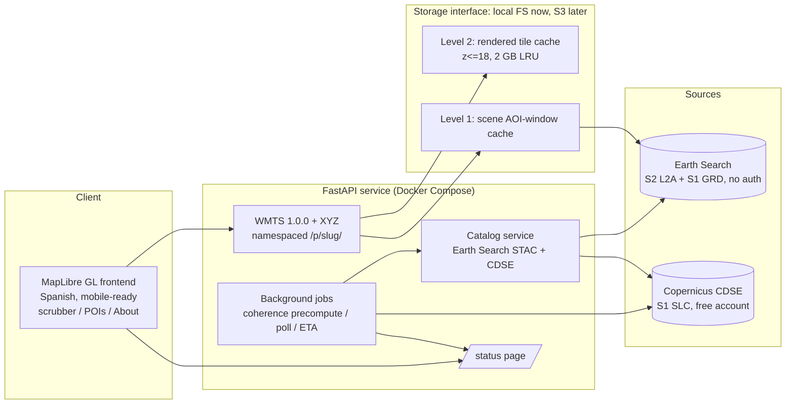

# Mirar Setena — Scope & Implementation Plan

Web GIS app that shows the **CDP Río General** project (authorized by SETENA Resolution 1333-2017) — its scope on a map and its progress over time — using freely available ESA Sentinel satellite data. Personal monitoring tool first, architected so other SETENA projects can be loaded later.

- **Repo:** https://github.com/Hemofektik/mirarsetena
- **Source documents:** `samples/RES-1333-2017/` — resolution ES+EN (committed here as public documents); registry printouts, plan certificates and plan scan images are kept local because they contain personal identity numbers (see `.gitignore`)

---

## 1. Project & site facts (from the attached documents)

| Item | Value |
|---|---|
| Project | CDP Río General — extract material from Río General channel (11 ha) + crushing plant, storage yard, wet processing on adjacent parcel |
| Developer | Vientos del Noroeste ABM, S.A. (ID 3-101-393860) |
| Resolution | 1333-2017-SETENA, 07-Jul-2017; file D1-11642-2013-SETENA |
| Location | San José, Pérez Zeledón, General Viejo / El General; San Isidro sheet 1:50,000 |
| Parcels | 1-101880-000 (plan SJ-980861-1991, 111,826.59 m²) and 1-386536-000 (plan SJ-980860-1991, 111,820.13 m²) |
| Machinery | D-8 tractor + excavator Cat 345-class |
| Conditions | 2-year start window conditioned on mining guarantee; guarantee ¢180,000 + $4,000/linear km; consolidated construction report, then reports every 6 months |
| Works on ground | Started ~Aug 2026 (~2 months before this plan) |
| AOI extent | ~1.7 × 1.2 km; WGS84 ≈ 9.3797–9.3953 °N, −83.6734 … −83.6621 ° |
| Known doc discrepancy | Resolution cites plan SJ-**0980661**-1991; the actual registration (per scan stamp) is **980861** — resolution typo |

Geometry sources: the **derrotero (bearing/distance) tables on the two 1991 plan scans** (Appendix A) + the CRTM05 registry coordinates (Appendix B). No polygon exists in any digital form → it must be reconstructed.

---

## 2. Measured data facts (verified 2026-10-06 against live endpoints)

| Source | Endpoint | Result for this AOI, 2026-07-01 → today |
|---|---|---|
| Sentinel-2 L2A | Element 84 Earth Search STAC (`earth-search.aws.element84.com/v1`), no auth | **47 items / 24 distinct dates** (~4–5 day cadence; S2A/2B/2C all active). Some dates return **two adjacent tiles → pipeline must mosaic**. Cloud % not present as expected in catalog → compute per-date AOI cloud from SCL band. |
| Sentinel-1 GRD | same, no auth | **8 scenes, exact 12-day cadence** (Jul 11 → Oct 3), platform **Sentinel-1D**, IW, VV+VH, 10 m COG, full ~250 km scenes. Two pass times observed (23:47 descending, 11:22) → coherence pairing must respect orbit state. |
| Sentinel-1 SLC | **not available** on free AWS catalog (0 results) | Requires free **Copernicus CDSE** account (decision: register; token flow wired into service; ASF Earthdata as fallback). |

Consequences: the v1 core (S2 layers + σ⁰ change) runs **account-free**; only the coherence layer depends on a token.

---

## 3. Decision log (grilling rounds 1–5)

### Round 1 — fundamentals
| # | Decision |
|---|---|
| Q1 | Purpose: **own analytical tool** (b). Public read-only when deployed. |
| Q2 | Window: recent years → refined in R2 to start **2026-07-01**. |
| Q3 | Indicators: **bare-ground expansion + vegetation (NDVI) + river change + Sentinel-1 change** (a+b+c+e). |
| Q4 | **Elevation out of scope v1** (honest explanation: S1 is not elevation data; DEM differencing deferred). |
| Q5 | Architecture: on-demand tile service (d) → refined in R2-Q5/Q6 to WMTS with caching. |
| Q6 | **WMTS must know whether new data is available for the requested ROI.** |
| Q7 | AOI from original plans (given the scans: → derrotero reconstruction). |
| Q8 | Temporal UX: **timeline scrubber only** for now; first-detection heatmap later. |
| Q9 | Platform: **desktop + responsive mobile**; no offline/PWA. |
| Q10 | Budget: **free only**; host locally now, cheap/free AWS instance later. |

### Round 2 — data & processing
| # | Decision |
|---|---|
| Q1 | Sentinel-1 scope: **σ⁰ change + coherence**; preprocessing background job starts **after plain data is first viewed**. |
| Q2 | Timeline start: **2026-07-01** (≈1 month clean baseline before works). Works-start marker ≈ Aug 2026 (adjustable). |
| Q3 | Sentinel-2 layers: **RGB + NDVI + MNDWI + BSI**. |
| Q4 | **Full OGC WMTS 1.0.0** + XYZ raster tiles from the same handlers (QGIS usable as second client). |
| Q5 | Freshness: **hybrid** — scheduled catalog poll + orbit-repeat prediction of next acquisition. |
| Q6 | **Two-level cache** (scene-level source window + rendered tiles) behind a storage interface: local FS now, S3-compatible later. |
| Q7 | AOI: reconstruct from plans; **also add the POIs from the project plan** (8 named CRTM points + 2 GPS inspection points). |
| Q8 | Stack: **Python FastAPI + rasterio/GDAL + pystac-client; MapLibre GL frontend; Docker Compose** locally, same compose on AWS later. |
| Q9 | Access: **no auth ever** (public read-only when deployed). |
| Q10 | UI language: **Spanish primary**, i18n-ready string layer (English later). |

### Round 3 — service & UX
| # | Decision |
|---|---|
| Q1 | SLC account: **Copernicus CDSE** (a); ASF fallback. |
| Q2 | Coherence job: **full-window eager** from 2026-07-01, then one new pair appended per new scene, forever. |
| Q3 | Export: **shareable URL state + PNG screenshot** (GeoTIFF deferred). |
| Q4 | Basemap: **OSM default + Esri World Imagery toggle** (with attribution). |
| Q5 | POIs: **single toggleable labeled layer, two groups** — project facilities vs inspection points. |
| Q6 | Cache: **cap zoom 18; 2 GB soft budget for rendered tiles with LRU eviction**; source-scene cache always retained (tiles re-renderable). |
| Q7 | **`/status` page**: cache sizes, last catalog check, pending jobs, **predicted next acquisition** per mission (from repeat cycles), last scene seen. |
| Q8 | **Cloud intelligence**: per-date AOI cloud % computed from SCL, badges on scrubber, "hide cloudy dates" toggle. |
| Q9 | **About panel**: resolution source, Copernicus/ESA attribution (mandatory), parcel reconstruction method, "unofficial tool, not affiliated with SETENA" disclaimer. |
| Q10 | Phase-2 register confirmed (see §5). |

### Round 4 — naming & data flow
| # | Decision |
|---|---|
| Q1 | **Dual catalog**: Earth Search STAC (no-auth) for S2/GRD discovery + date lists; CDSE queried **only** for SLC/coherence → expired token degrades only the coherence layer. |
| Q2 | **Layer-driven scrubber dates**: RGB/NDVI/MNDWI/BSI → S2 dates; σ⁰/coherence → S1 dates (mission implied by layer). |
| Q3 | S1 layers rendered as **change-vs-baseline** (dB / 0–1 ramps), baseline defaults to pre-works July 2026 scenes, **UI baseline selector**, plus raw-grayscale toggle. |
| Q4 | SLC handling: **compute-and-purge** — download, compute coherence pair, delete source; only small results cached (bounded disk forever). |
| Q5 | Name: **Mirar Setena**. |

### Round 5 — generalization & repository
| # | Decision |
|---|---|
| Q1 | **Config-driven project registry**: all routes/cache keys/layers date-lists namespaced by project slug (`/p/cdp-rio-general/...`); v1 ships exactly one project; adding a project = adding a config file; **no admin UI**. |
| Q2 | **GeoJSON is the canonical project-geometry format** (AOI + POIs in config); the derrotero reconstruction lives as a one-off generator script producing that format. |
| Q3 | **MIT license.** |
| Q4 | **README.md (English) + README.es.md (Spanish)**, cross-linked. |
| Q5 | **Minimal GitHub Actions CI**: lint + unit tests + Docker build on push. |

Plus: **"create the repo and push once the plan is ready"** (user's credentials installed locally).

---

## 4. Architecture

- **Frontend:** MapLibre GL, layer switcher → layer-driven date scrubber (works-start marker, cloud badges, hide-cloudy), POI toggle (facilities / inspection groups), OSM default + Esri imagery toggle, URL state sharing, PNG export, About panel, i18n-ready ES strings.
- **Tile service:** WMTS 1.0.0 (GetCapabilities/GetTile) + XYZ raster over shared handlers; per-project slug namespacing; zoom cap 18; tile LRU at 2 GB, sources retained.
- **S2 pipeline:** STAC fetch → dual-tile mosaicking → RGB/NDVI/MNDWI/BSI + SCL cloud % → two-level cache.
- **S1 pipeline:** GRD COG fetch → σ⁰ change-vs-baseline (baseline selector, raw toggle).
- **Coherence pipeline:** CDSE token → SLC pairs (same orbit, 12-day, eager from 2026-07-01) → compute-and-purge → cached result only. Triggered after first plain-data view; thereafter append-only.
- **Freshness:** scheduled catalog poll + orbit-repeat prediction surfaced on `/status` (per your Q5: the server knows from orbit/past data whether new data may be available).

---

## 5. Scope

**v1 (this plan):** everything in §4 + decision log above.

**Phase-2 register (explicitly deferred, in rough priority):**
1. Elevation change (DEM differencing: Copernicus DEM vs SRTM, accuracy caveats documented)
2. First-detection-date heatmap
3. Time-series charts (NDVI / bare-ground % over AOI)
4. Before/after swipe comparison
5. Flood/water-extent mapping (S1)
6. GeoTIFF clip export
7. InSAR deformation time series (research tier)

---

## 6. Implementation plan & progress

The work is split into 35 TDD/BDD-sized increments — each with its failing tests first, an executable acceptance scenario, and a status checkbox — in **[docs/IMPLEMENTATION.md](./IMPLEMENTATION.md)**. That document is the single source of truth for *what is implemented and what is missing*; its progress board summarizes it. Phases map 1:1 to these coarse todos: `init-repo`→A, `aoi-reconstruction`→B, `scaffold-backend`→C, `s2-pipeline`→D, `s1-grd-pipeline`→E, `wmts-service`→F, `background-jobs`→G, `cdse-coherence`→H, `frontend`→I, `ci-pipeline`→J, `e2e-verify`→K.

---

## 7. Open implementation notes (facts to verify, not decisions)

- **Derrotero tables (Appendix A) corrected against the scans on 2026-10-06 and validated:** plan 980860 closes at **0.02 m** with area **+0.006 %** of stated, plan 980861 at **0.05 m** with area **−0.010 %**, and their shared edge (leg 13-1 = 89°19′ ↔ leg 4-5 = 269°19′) is opposed by exactly 180°. The reconstruction script still enforces **traverse closure (< 2 m) and computed area (±1 % of stated)** as hard acceptance checks.
- **Registry anchor points** (Appendix B) name one CRTM coordinate per plan but not which vertex → script tries each vertex and selects the anchor consistent with both plans sharing their common edge, Río General on the west, Quebrada Grande SE, road east, and neighbor labels on the scans.
- **CDSE API specifics to confirm during implementation:** exact SLC scene size at this latitude, bbox-clip availability, OAuth token flow, rate limits (does not change the decision, only implementation).
- **Attribution requirements:** Copernicus/ESA notice on all imagery; Esri attribution on imagery basemap; OSM ODbL attribution.
- **Works-start marker** is "~Aug 2026" — expose as config so it can be corrected.
- **Sentinel-1 pairing rule:** same relative orbit + orbit state (descending 23:47 vs 11:22 passes observed), 12-day temporal baseline.
- **AWS later:** only the storage interface + compose environment change (no auth code, LRU budget already sized for free tier).

---

## Appendix A — Derrotero transcription (from plan scans)

Closed polar traverse, linear error 1.03 m, angular error 0°03′, protocol Tomo 6339 Folio 72-74, owner Carlos Montero Durán.

**Plan SJ-980860-1991 — finca 1-386536-000, area 111,820.13 m², 13 legs** (neighbors: N Carlos Montero Durán, S José Angel Duarte Céspedes, W Río General, SE Quebrada Grande, E public road 14.90 m wide)

| Leg | Azimuth °′ | Distance m·cm |
|---|---|---|
| 1–2 | 159 19 | 0 68 |
| 2–3 | 188 24 | 133 45 |
| 3–4 | 144 40 | 5 43 |
| 4–5 | 222 25 | 29 74 |
| 5–6 | 239 51 | 15 44 |
| 6–7 | 270 09 | 88 83 |
| 7–8 | 272 12 | 248 80 |
| 8–9 | 272 37 | 273 98 |
| 9–10 | 322 19 | 19 01 |
| 10–11 | 232 57 | 99 15 |
| 11–12 | 0 59 | 104 40 |
| 12–13 | 20 52 | 81 59 |
| 13–1 | 89 19 | 720 62 |

**Plan SJ-980861-1991 — finca 1-101880-000, area 111,826.59 m², 9 legs** (neighbors: N/W Fernando Montero Muñoz, S Carlos Montero Durán, W Río General, SE Quebrada Grande, E public road; "fin de servidumbre de paso 3,50 m")

| Leg | Azimuth °′ | Distance m·cm |
|---|---|---|
| 1–2 | 193 02 | 50 24 |
| 2–3 | 185 27 | 136 71 |
| 3–4 | 159 21 | 61 14 |
| 4–5 | 269 19 | 720 62 |
| 5–6 | 20 52 | 49 37 |
| 6–7 | 55 38 | 159 93 |
| 7–8 | 99 01 | 256 84 |
| 8–9 | 352 15 | 123 82 |
| 9–1 | 84 34 | 338 31 |

## Appendix B — Coordinates (CRTM05 → WGS84, EPSG:5367 → EPSG:4326)

**Project POIs** (single toggleable layer: facilities = the 8 named points; inspection = the 2 GPS points from the 2016 site visit)

| POI | CRTM05 E | CRTM05 N | Lat | Lon | Group |
|---|---|---|---|---|---|
| Project start | 536563.07 | 1038887.01 | 9.395319 | −83.667080 | facilities |
| Project end | 535875.09 | 1037161.53 | 9.379723 | −83.673359 | facilities |
| Internal road start | 537111.26 | 1037658.20 | 9.384204 | −83.662099 | facilities |
| Internal road end | 535930.27 | 1037621.41 | 9.383881 | −83.672852 | facilities |
| Breaker | 536330.97 | 1037785.53 | 9.385362 | −83.669203 | facilities |
| Dumper ramp | 536305.57 | 1037794.19 | 9.385440 | −83.669434 | facilities |
| Office | 536399.10 | 1037730.11 | 9.384860 | −83.668583 | facilities |
| Storage | 536340.21 | 1037787.27 | 9.385377 | −83.669118 | facilities |
| Channel (inspection) | 536311 | 1037790 | 9.385402 | −83.669384 | inspection |
| Quarry (inspection) | 536043 | 1037805 | 9.385540 | −83.671824 | inspection |

**Registry anchor points (one per plan, CRTM05):** plan 980860 → E 536314, N 1037219 (9.380239, −83.669362); plan 980861 → E 536414, N 1037419 (9.382047, −83.668450).

**Access (from resolution):** project-area access ~1 km north of General Viejo church.
